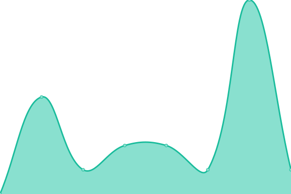
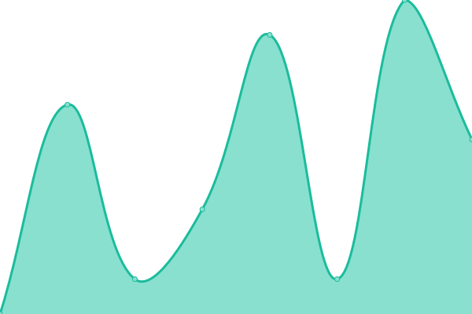

# [📈 Live Status](https://VoisinsVigilants.github.io/upptime_production): <!--live status--> **🟩 All systems operational**

This repository contains the open-source uptime monitor and status page for [VoisinsVigilants](https://VoisinsVigilants.github.io/upptime_production), powered by [Upptime](https://github.com/upptime/upptime).

With [Upptime](https://upptime.js.org), you can get your own unlimited and free uptime monitor and status page, powered entirely by a GitHub repository. We use [Issues](https://github.com/VoisinsVigilants/upptime_production/issues) as incident reports, [Actions](https://github.com/VoisinsVigilants/upptime_production/actions) as uptime monitors, and [Pages](https://VoisinsVigilants.github.io/upptime_production) for the status page.

<!--start: status pages-->
<!-- This summary is generated by Upptime (https://github.com/upptime/upptime) -->
<!-- Do not edit this manually, your changes will be overwritten -->
<!-- prettier-ignore -->
| URL | Status | History | Response Time | Uptime |
| --- | ------ | ------- | ------------- | ------ |
|  [B2B - Voisins Vigilants Connect (PROD)](https://voisinsvigilants-connect.org) | 🟩 Up | [b2-b-voisins-vigilants-connect-prod.yml](https://github.com/VoisinsVigilants/upptime_production/commits/HEAD/history/b2-b-voisins-vigilants-connect-prod.yml) | 

 982ms
     
 | 

<a href="https://VoisinsVigilants.github.io/upptime_production/history/b2-b-voisins-vigilants-connect-prod">100.00%</a>
    

|  [Hodatis (Staging)](https://hodatis.com) | 🟩 Up | [hodatis-staging.yml](https://github.com/VoisinsVigilants/upptime_production/commits/HEAD/history/hodatis-staging.yml) | 

 997ms
     
 | 

<a href="https://VoisinsVigilants.github.io/upptime_production/history/hodatis-staging">100.00%</a>
    

|  [Api B2C - Api Voisins Vigilants (PROD)](api-flutter.voisinsvigilants.org) | 🟩 Up | [api-b2-c-api-voisins-vigilants-prod.yml](https://github.com/VoisinsVigilants/upptime_production/commits/HEAD/history/api-b2-c-api-voisins-vigilants-prod.yml) | 

 3ms
     
 | 

<a href="https://VoisinsVigilants.github.io/upptime_production/history/api-b2-c-api-voisins-vigilants-prod">100.00%</a>
    

|  [Web B2C - Voisins Vigilants (PROD)](https://app.voisinsvigilants.org) | 🟩 Up | [web-b2-c-voisins-vigilants-prod.yml](https://github.com/VoisinsVigilants/upptime_production/commits/HEAD/history/web-b2-c-voisins-vigilants-prod.yml) | 

 263ms
     
 | 

<a href="https://VoisinsVigilants.github.io/upptime_production/history/web-b2-c-voisins-vigilants-prod">100.00%</a>
    

|  [Data - Voisins Vigilants Data (PROD)](https://voisinsvigilants-data.org/) | 🟩 Up | [data-voisins-vigilants-data-prod.yml](https://github.com/VoisinsVigilants/upptime_production/commits/HEAD/history/data-voisins-vigilants-data-prod.yml) | 

 859ms
     
 | 

<a href="https://VoisinsVigilants.github.io/upptime_production/history/data-voisins-vigilants-data-prod">100.00%</a>
    

|  [Territoire - Territoire Vigilant (PROD)](https://territoirevigilant.org) | 🟩 Up | [territoire-territoire-vigilant-prod.yml](https://github.com/VoisinsVigilants/upptime_production/commits/HEAD/history/territoire-territoire-vigilant-prod.yml) | 

 909ms
     
 | 

<a href="https://VoisinsVigilants.github.io/upptime_production/history/territoire-territoire-vigilant-prod">100.00%</a>
    

<!--end: status pages-->

[**Visit our status website →**](https://VoisinsVigilants.github.io/upptime_production)

## 📄 License

- Powered by: [Upptime](https://github.com/upptime/upptime)
- Code: [MIT](./LICENSE) © [Anand Chowdhary](https://anandchowdhary.com), supported by [Pabio](https://pabio.com)
- Data in the `./history` directory: [Open Database License](https://opendatacommons.org/licenses/odbl/1-0/)
